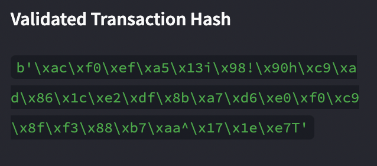
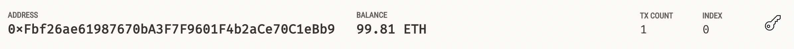
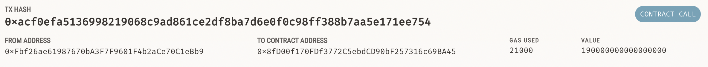

# Fintech Finder

 Fintech Finder is an application that customeres can use to find fintech professionals among a list of candidates, hire them, and pay them instantly using the cryptocurrency Ethereum. This is an automated app that allows us to generate a digital wallet, access Ethereum account balances, and sign/send transactions via a personal Ethereum blockchain called Ganache. When successful, the web application will congratulate the customer and provide a hash code for the user to review the blockchain transaction details.

---

## Required Modules/Libraries

Web3.py: A Python library for connecting to and performing operations on Ethereum-based blockchains.

ethereum-tester: A Python library that provides access to the tools we’ll use to test Ethereum-based applications.

mnemonic: A Python implementation for generating a 12- or 24-word mnemonic seed phrase based on the BIP-39 standard.

bip44: A Python implementation for deriving hierarchical deterministic wallets from a seed phrase based on the BIP-44 standard.

Ganache: ​​A program that allows you to quickly set up a local blockchain, which you can use to test and develop smart contracts.

---

## Screenshots

Website:

Ganache Transactions:

